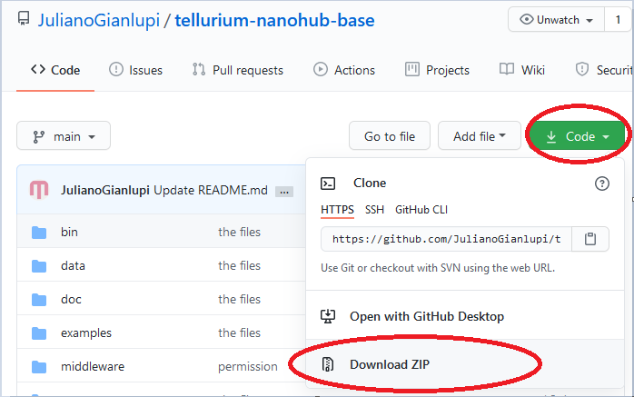
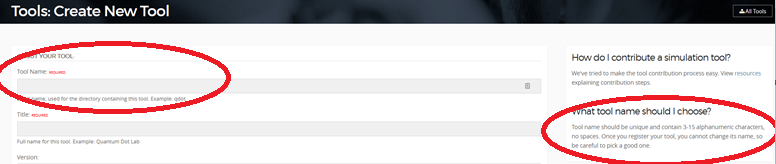
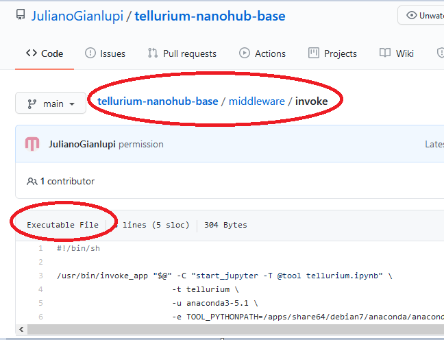

# Getting your tellurium project on nanohub

1. Create a GitHub account [https://github.com/join?ref\_cta=Sign+up](https://github.com/join?ref_cta=Sign+up)
2. Fork or Copy this repository on your computer [https://github.com/JulianoGianlupi/tellurium-nanohub-base](https://github.com/JulianoGianlupi/tellurium-nanohub-base)
    1. It&#39;s a good idea to download gitbash [https://www.educative.io/edpresso/how-to-install-git-bash-in-windows](https://www.educative.io/edpresso/how-to-install-git-bash-in-windows) . Git bash works as a linux / macOS terminal but with more commands, maybe mac/linux people already have git commands built into the terminal.
    2. And github desktop will also help [https://desktop.github.com/](https://desktop.github.com/). If you are not familiar with command line stuff this is a good option – even if you are familiar this will allow you to not have to look up a bunch of git commands, although I recommend you learn to use github regardless
    3. You can download the repo as a zip



3. In the unzipped files replace the jupyter notebook there by your own (do not place spaces in the notebook name). In other words: replace tellurium.ipynb with \&lt;YOUR\_NOTEBOOK\_NAME\&gt;.ipynb
4. In the unzipped files, under the folder middleware, open the file invoke (use notepad or notepad++) and replace tellurium.ipynb with the name of your jupyter notebook
5. Also in the middleware/invoke file replace &quot;-t tellurium&quot; with &quot;-t short\_tool\_name&quot;. short\_tool\_name will be the name nanohub uses in the url for your tool and to call it, it **must** match &quot;Tool Name&quot; in [https://nanohub.org/tools/create](https://nanohub.org/tools/create). It must be 3-15 alphanumeric characters, no spaces. Once you register your tool, you cannot change this name, so be careful to pick a good one.
    1. If you had already done this before Friday 12/18 either pull again from the repo or change &quot;start\_jupyter -T @tool tellurium.ipynb&quot; to &quot;start\_jupyter -t -T @tool tellurium.ipynb&quot;
    2. If you want your notebook to open on app mode you have to add a -A before the -T in that string
    3. The &quot;not short&quot; tool name will be the Title in that box, that&#39;s the one people will mainly see



6. Create a new repository to host (upload) your files ([https://docs.github.com/en/free-pro-team@latest/github/getting-started-with-github/create-a-repo](https://docs.github.com/en/free-pro-team@latest/github/getting-started-with-github/create-a-repo)) and upload them
7. On github make sure middleware/invoke is executable; open the file in github, the upper left corner will say if it is or not
    1. If it isn&#39;t: open gitbash, go to the folder containing your repo and issue the command ```git update-index --chmod=+x middleware/invoke``` and push the changes to the repo



8. Follow the steps in [https://nanohub.org/tools/create](https://nanohub.org/tools/create)
